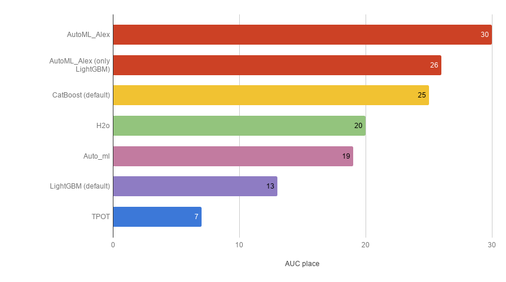

# AutoML-Benchmark
A Performance Benchmark of Different AutoML Frameworks

---

## Frameworks
In the benchmark framework:
* [H2o](http://docs.h2o.ai/h2o/latest-stable/h2o-docs/automl.html)
* [TPOT](https://github.com/EpistasisLab/tpot)
* [Auto_ml](https://github.com/ClimbsRocks/auto_ml)
* [CatBoost](https://github.com/catboost/catboost) (default params)
* [LightGBM](https://github.com/microsoft/LightGBM) (default params)
* [AutoML_Alex](https://github.com/Alex-Lekov/AutoML_Alex) 
* AutoML_Alex (only LightGBM)

## Binary-Classification
Sum of positions in the rating for all datasets. (The bigger, the better):

| Framework | AUC place |
| ------ | ------ |

| AutoML_Alex | 30 |
| AutoML_Alex (only LightGBM) | 26 |
| CatBoost (default) | 25 |
| H2o | 20 |
| Auto_ml | 19 |
| LightGBM (default) | 13 |
| TPOT | 7 |

Total AUC on datasets:

<table>
  <tr>
   <td>Framework/dataset
   </td>
   <td colspan="2" ><strong>adult</strong>
   </td>
   <td colspan="2" ><strong>Amazon_employee_access</strong>
   </td>
   <td colspan="2" ><strong>bank-marketing</strong>
   </td>
   <td colspan="2" ><strong>Click_prediction_small</strong>
   </td>
   <td colspan="2" ><strong>credit-g</strong>
   </td>
  </tr>
  <tr>
   <td>
   </td>
   <td>auc
   </td>
   <td>auc_std
   </td>
   <td>auc
   </td>
   <td>auc_std
   </td>
   <td>auc
   </td>
   <td>auc_std
   </td>
   <td>auc
   </td>
   <td>auc_std
   </td>
   <td>auc
   </td>
   <td>auc_std
   </td>
  </tr>
  <tr>
   <td>TPOT
   </td>
   <td>

0,9126

   </td>
   <td>0,0026
   </td>
   <td>

0,7895

   </td>
   <td>

0,0339

   </td>
   <td>

0,8492

   </td>
   <td>

0,0070

   </td>
   <td>

0,7114

   </td>
   <td>

0,0045

   </td>
   <td>

0,7816

   </td>
   <td>

0,0189

   </td>
  </tr>
  <tr>
   <td>H2o
   </td>
   <td>

0,9143

   </td>
   <td>0,0020
   </td>
   <td>

0,8551

   </td>
   <td>

0,0030

   </td>
   <td>

0,9371

   </td>
   <td>

0,0037

   </td>
   <td>

0,7206

   </td>
   <td>

0,0041

   </td>
   <td>

0,7765

   </td>
   <td>

0,0479

   </td>
  </tr>
  <tr>
   <td>LightGBM (default)
   </td>
   <td>

0,9144

   </td>
   <td>0,0037
   </td>
   <td>

0,8463

   </td>
   <td>

0,0113

   </td>
   <td>

0,9365

   </td>
   <td>

0,0034

   </td>
   <td>

0,7160

   </td>
   <td>

0,0057

   </td>
   <td>

0,7795

   </td>
   <td>

0,0274

   </td>
  </tr>
  <tr>
   <td>Auto_ml
   </td>
   <td>

0,9147

   </td>
   <td>0,0033
   </td>
   <td>

0,8286

   </td>
   <td>

0,0144

   </td>
   <td>

0,9035

   </td>
   <td>

0,0058

   </td>
   <td>

0,7188

   </td>
   <td>

0,0066

   </td>
   <td>

0,7925

   </td>
   <td>

0,0227

   </td>
  </tr>
  <tr>
   <td>AutoML_Alex (only LightGBM)
   </td>
   <td>

0,9148

   </td>
   <td>0,0036
   </td>
   <td>

0,8577

   </td>
   <td>

0,0080

   </td>
   <td>

0,9385

   </td>
   <td>

0,0030

   </td>
   <td>

0,7173

   </td>
   <td>

0,0044

   </td>
   <td>

0,7852

   </td>
   <td>

0,0311

   </td>
  </tr>
  <tr>
   <td>CatBoost (default)
   </td>
   <td>

0,9150

   </td>
   <td>0,0030
   </td>
   <td>

0,8467

   </td>
   <td>

0,0090

   </td>
   <td>

0,9379

   </td>
   <td>

0,0040

   </td>
   <td>

0,7191

   </td>
   <td>

0,0058

   </td>
   <td>

0,7837

   </td>
   <td>

0,0222

   </td>
  </tr>
</table>