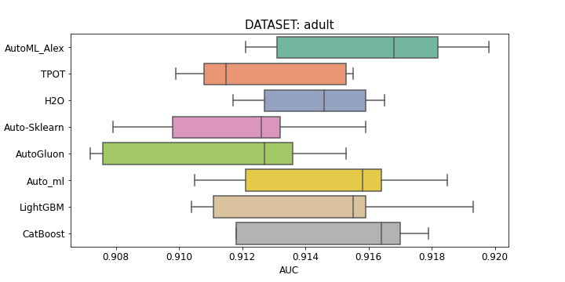
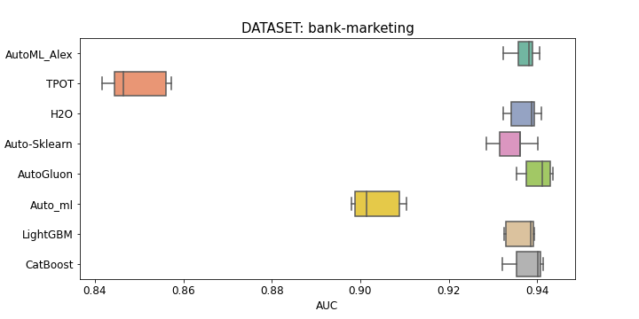
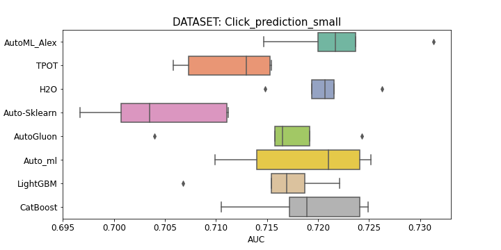

# AutoML-Benchmark
A Performance Benchmark of Different AutoML Frameworks

---

# Frameworks
In the benchmark framework:
* [H2o](http://docs.h2o.ai/h2o/latest-stable/h2o-docs/automl.html) -
* [TPOT](https://github.com/EpistasisLab/tpot) v0.11.1
* [Auto_ml](https://github.com/ClimbsRocks/auto_ml) -
* [CatBoost](https://github.com/catboost/catboost) (default params) v0.22
* [LightGBM](https://github.com/microsoft/LightGBM) (default params) v2.3.1
* [AutoML_Alex](https://github.com/Alex-Lekov/AutoML_Alex) v0.07.26

# Benchmark Settings
* Repeated 5 times (on 5 K-folds)
* Time Limit 1 hour on fold
* Chose datasets from 1000 and more rows/examples
* Docker

# Binary-Classification
Sum of revers positions in the rating for all datasets. (The bigger, the better):

| Framework | Place |
| ------ | ------ |
| AutoML_Alex | 29 |
| CatBoost | 23 |
| H2o | 17 |
| Auto_ml | 16 |
| LightGBM | 13 |
| TPOT | 7 |

## Total AUC on datasets:

<table>
  <tr>
   <td>Framework/dataset
   </td>
   <td colspan="2" ><strong><a href="./binary-classification/datasets/adult">adult</a></strong>
   </td>
   <td colspan="2" ><strong><a href="./binary-classification/datasets/Amazon_employee_access">amazon</a></strong>
   </td>
   <td colspan="2" ><strong><a href="./binary-classification/datasets/bank-marketing">bank-marketing</a></strong>
   </td>
   <td colspan="2" ><strong><a href="./binary-classification/datasets/Click_prediction_small">click_predict</a></strong>
   </td>
   <td colspan="2" ><strong><a href="./binary-classification/datasets/credit-g">credit-g</a></strong>
   </td>
  </tr>
  <tr>
   <td>
   </td>
   <td>auc
   </td>
   <td>auc_std
   </td>
   <td>auc
   </td>
   <td>auc_std
   </td>
   <td>auc
   </td>
   <td>auc_std
   </td>
   <td>auc
   </td>
   <td>auc_std
   </td>
   <td>auc
   </td>
   <td>auc_std
   </td>
  </tr>
    <tr>
   <td><b>AutoML_Alex</b>
   </td>
   <td>
<b>0,9160</b></td>
   <td>
0,0033</td>
   <td>
<b>0,8687</b></td>
   <td>
0,0139</td>
   <td>
<b>0,9379</b></td>
   <td>
0.0038</td>
   <td>
<b>0,7231</b></td>
   <td>
0,0076</td>
   <td>
<b>0,8043</b></td>
   <td>
0,0235
   </td>
  </tr>

  <tr>
   <td>TPOT
   </td>
   <td>
0,9126</td>
   <td>
0,0026</td>
   <td>
0,7895</td>
   <td>
0,0339</td>
   <td>
0,8492</td>
   <td>
0,0070</td>
   <td>
0,7114</td>
   <td>
0,0045</td>
   <td>
0,7816</td>
   <td>
0,0189</td>
  </tr>
  <tr>
   <td>H2o
   </td>
   <td>
0,9143</td>
   <td>
0,0020</td>
   <td>
0,8551</td>
   <td>
0,0030</td>
   <td>
0,9371</td>
   <td>
0,0037</td>
   <td>
0,7206</td>
   <td>
0,0041</td>
   <td>
0,7765</td>
   <td>
0,0479</td>
  </tr>

  <tr>
   <td>Auto_ml
   </td>
   <td>
0,9147</td>
   <td>
0,0033</td>
   <td>
0,8286</td>
   <td>
0,0143</td>
   <td>
0,9035</td>
   <td>
0,0058</td>
   <td>
0,7188</td>
   <td>
0,0066</td>
   <td>
0,7925</td>
   <td>
0,0227</td>
  </tr>

  <tr>
   <td>LightGBM
   </td>
   <td>
0,9144</td>
   <td>
0,0037</td>
   <td>
0,8463</td>
   <td>
0,0113</td>
   <td>
0,9365</td>
   <td>
0,0034</td>
   <td>
0,7160</td>
   <td>
0,0057</td>
   <td>
0,7795</td>
   <td>
0,0274</td>
  </tr>
  <tr>
   <td>CatBoost
   </td>
   <td>
0,9150</td>
   <td>
0,0030</td>
   <td>
0,8467</td>
   <td>
0,0090</td>
   <td>
<b>0,9379</b></td>
   <td>
0,0040</td>
   <td>
0,7191</td>
   <td>
0,0058</td>
   <td>
0,7837</td>
   <td>
0,0222</td>
  </tr>
</table>

## Boxplot Scores:

