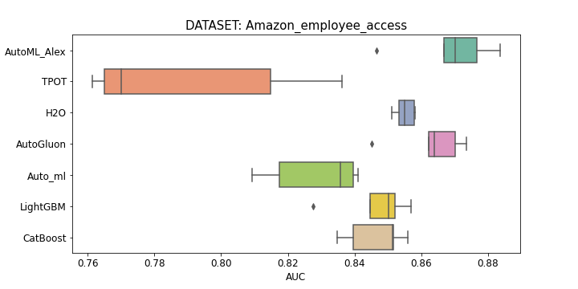
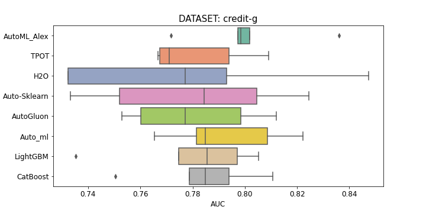

# AutoML-Benchmark
A Performance Benchmark of Different AutoML Frameworks

---

# Frameworks
In the benchmark framework:
* [H2o](http://docs.h2o.ai/h2o/latest-stable/h2o-docs/automl.html) -
* [TPOT](https://github.com/EpistasisLab/tpot) v0.11.2
* [Auto-sklearn](https://github.com/automl/auto-sklearn/) v0.8.0
* [AutoGluon](https://github.com/awslabs/autogluon) v0.0.12
* [Auto_ml](https://github.com/ClimbsRocks/auto_ml) -
* [CatBoost](https://github.com/catboost/catboost) (default params) v0.22
* [LightGBM](https://github.com/microsoft/LightGBM) (default params) v2.3.1
* [AutoML_Alex](https://github.com/Alex-Lekov/AutoML_Alex) v0.07.26

# Benchmark Settings
* Repeated 5 times (on 5 K-folds)
* Time Limit 1 hour on fold
* Chose datasets from 1000 and more rows/examples
* Docker

### Server: 
AWS: [m5d.4xlarge](https://aws.amazon.com/ru/ec2/instance-types/m5/)

# Binary-Classification
Sum of revers positions in the rating for all datasets. (The bigger, the better):

| Framework | Place |
| ------ | ------ |
| AutoML_Alex | 51 |
| AutoGluon | 44 |
| CatBoost | 38 |
| H2o | 34 |
| Auto_ml | 28 |
| LightGBM | 23 |
| Auto-sklearn | 20 |
| TPOT | 14 |

## Datasets
Chose datasets from 1000 and more rows/examples
and on which the problem has not yet been solved with 99 AUC

| Name | OpenML ID | Features | Rows |
| ------ | ------ | ------ | ------ |
| [adult](./binary-classification/datasets/adult) | [179](https://www.openml.org/d/179) | 14 | 48842 |
| [Amazon_employee_access](./binary-classification/datasets/Amazon_employee_access) | [4135](https://www.openml.org/d/4135) | 9 | 32769 |
| [bank-marketing](./binary-classification/datasets/bank-marketing) | [1461](https://www.openml.org/d/1461) | 16 | 45211 |
| [Click_prediction_small](./binary-classification/datasets/Click_prediction_small) | [1226](https://www.openml.org/d/1226) | 11 | 798964 |
| [credit-g](./binary-classification/datasets/credit-g) | [31](https://www.openml.org/d/31) | 20 | 1000 |
| [eeg-eye-state](./binary-classification/datasets/eeg-eye-state) | [1471](https://www.openml.org/d/1471) | 14 | 14980 |
| [electricity](./binary-classification/datasets/electricity) | [151](https://www.openml.org/d/151) | 8 | 45312 |
| [kc1](./binary-classification/datasets/kc1) | [1067](https://www.openml.org/d/1067) | 20 | 2109 |
| [mozilla4](./binary-classification/datasets/mozilla4) | [1046](https://www.openml.org/d/1046) | 5 | 15545 |
| [phoneme](./binary-classification/datasets/phoneme) | [1489](https://www.openml.org/d/1489) | 5 | 5404 |
| [qsar-biodeg](./binary-classification/datasets/qsar-biodeg) | [1494](https://www.openml.org/d/1494) | 41 | 1055 |

### Total AUC on datasets:

<table>
  <tr>
   <td>Framework/dataset
   </td>
   <td colspan="2" ><strong><a href="./binary-classification/datasets/adult">adult</a></strong>
   </td>
   <td colspan="2" ><strong><a href="./binary-classification/datasets/Amazon_employee_access">amazon</a></strong>
   </td>
   <td colspan="2" ><strong><a href="./binary-classification/datasets/bank-marketing">bank-marketing</a></strong>
   </td>
   <td colspan="2" ><strong><a href="./binary-classification/datasets/Click_prediction_small">click_predict</a></strong>
   </td>
   <td colspan="2" ><strong><a href="./binary-classification/datasets/credit-g">credit-g</a></strong>
   </td>
   <td colspan="2" ><strong><a href="./binary-classification/datasets/eeg-eye-state">eeg-eye-state</a></strong>
   </td>
   <td colspan="2" ><strong><a href="./binary-classification/datasets/electricity">electricity</a></strong>
   </td>
   <td colspan="2" ><strong><a href="./binary-classification/datasets/kc1">kc1</a></strong>
   </td>
   <td colspan="2" ><strong><a href="./binary-classification/datasets/mozilla4">mozilla4</a></strong>
   </td>
   <td colspan="2" ><strong><a href="./binary-classification/datasets/phoneme">phoneme</a></strong>
   </td>
   <td colspan="2" ><strong><a href="./binary-classification/datasets/qsar-biodeg">qsar-biodeg</a></strong>
   </td>
  </tr>
  <tr>
   <td>
   </td>
   <td>auc
   </td>
   <td>auc_std
   </td>
   <td>auc
   </td>
   <td>auc_std
   </td>
   <td>auc
   </td>
   <td>auc_std
   </td>
   <td>auc
   </td>
   <td>auc_std
   </td>
   <td>auc
   </td>
   <td>auc_std
   </td>
   </td>
   <td>auc
   </td>
   <td>auc_std
   </td>
    <td>auc
   </td>
   <td>auc_std
   </td>
    <td>auc
   </td>
   <td>auc_std
   </td>
   <td>auc
   </td>
   <td>auc_std
   </td>
   <td>auc
   </td>
   <td>auc_std
   </td>
   <td>auc
   </td>
   <td>auc_std
   </td>
  </tr>
    <tr>
   <td><b>AutoML_Alex</b>
   </td>
   <td>
<b>0,9160</b></td>
   <td>
0,0033</td>
   <td>
<b>0,8687</b></td>
   <td>
0,0139</td>
   <td>
0,9371</td>
   <td>
<em>0.0032</em></td>
   <td>
<b>0,7223</b></td>
   <td>
0,0060</td>
   <td>
<b>0,8011</b></td>
   <td>
0,0229
   </td>
   <td>0,9968</td>
   <td>0,0004</td>
   <td>0,9753</td>
   <td>0,0055</td>
   <td><b>0,8394</b></td>
   <td><em>0,0179</em></td>
   <td><b>0,9887</b></td>
   <td>0,0017</td>
   <td>0,9643</td>
   <td>0,0019</td>
   <td>0,9353</td>
   <td>0,0140</td>
  </tr>

  <tr>
   <td>TPOT
   </td>
   <td>
0,9126</td>
   <td>
0,0026</td>
   <td>
0,7895</td>
   <td>
0,0339</td>
   <td>
0,8492</td>
   <td>
0,0070</td>
   <td>
0,7114</td>
   <td>
0,0045</td>
   <td>
0,7816</td>
   <td>
<em>0,0189</em></td>
   <td>0,5</td>
   <td>0</td>
   <td>fail</td>
   <td></td>
   <td>fail</td>
   <td></td>
  </tr>
  
  <tr>
   <td>H2o
   </td>
   <td>
0,9143</td>
   <td>
<em>0,0020</em></td>
   <td>
0,8551</td>
   <td>
<em>0,0030</em></td>
   <td>
0,9371</td>
   <td>
0,0037</td>
   <td>
0,7206</td>
   <td>
<em>0,0041</em></td>
   <td>
0,7765</td>
   <td>
0,0479</td>
   <td>0,9887</td>
   <td>0,0016</td>
   <td>0,9842</td>
   <td>0,0006</td>
   <td>0,8024</td>
   <td>0,0380</td>
  </tr>

  <tr>
   <td>Auto-sklearn
   </td>
   <td>0,9112</td>
   <td>0,0031</td>
   <td>0,5</td>
   <td>0</td>
   <td>0,9345</td>
   <td>0,0045</td>
   <td>0,7046</td>
   <td>0,0064</td>
   <td>0,7798</td>
   <td>0,0373</td>
   <td>0,9926</td>
   <td>0,0026</td>
   <td>0,9652</td>
   <td>0,0021</td>
   <td>0,8246</td>
   <td>0,0227</td>
  </tr>

   <tr>
   <td>AutoGluon
   </td>
   <td>0,9148</td>
   <td>0,0032</td>
   <td>0,8577</td>
   <td>0,0124</td>
   <td><b>0,9401</b></td>
   <td>0,0034</td>
   <td>0,7159</td>
   <td>0,0074</td>
   <td>0,7801</td>
   <td>0,0249</td>
   <td><b>0,9993</b></td>
   <td><em>0,0002</em></td>
   <td><b>0,9886</b></td>
   <td>0,0006</td>
   <td>0,8286</td>
   <td>0,0265</td>
  </tr>

  <tr>
   <td>Auto_ml
   </td>
   <td>
0,9147</td>
   <td>
0,0033</td>
   <td>
0,8286</td>
   <td>
0,0143</td>
   <td>
0,9035</td>
   <td>
0,0058</td>
   <td>
0,7188</td>
   <td>
0,0066</td>
   <td>
0,7925</td>
   <td>
0,0227</td>
   <td>0,5</td>
   <td>0</td>
   <td>0,9617</td>
   <td><em>0,0018</em></td>
   <td>0,7940</td>
   <td>0,0267</td>
  </tr>

  <tr>
   <td>LightGBM
   </td>
   <td>
0,9144</td>
   <td>
0,0037</td>
   <td>
0,8463</td>
   <td>
0,0113</td>
   <td>
0,9365</td>
   <td>
0,0034</td>
   <td>
0,7160</td>
   <td>
0,0057</td>
   <td>
0,7795</td>
   <td>
0,0274</td>
   <td>0,9685</td>
   <td>0,0041</td>
   <td>0,9545</td>
   <td>0,0026</td>
   <td>0,7749</td>
   <td>0,0246</td>
  </tr>
  <tr>
   <td>CatBoost
   </td>
   <td>
0,9150</td>
   <td>
0,0030</td>
   <td>
0,8467</td>
   <td>
0,0090</td>
   <td>
0,9379</td>
   <td>
0,0040</td>
   <td>
0,7191</td>
   <td>
0,0058</td>
   <td>
0,7837</td>
   <td>
0,0222</td>
   <td>0,9823</td>
   <td>0,0023</td>
   <td>0,9563</td>
   <td>0,0034</td>
   <td>0,8224</td>
   <td>0,0226</td>
  </tr>
</table>

### Boxplot Scores:

